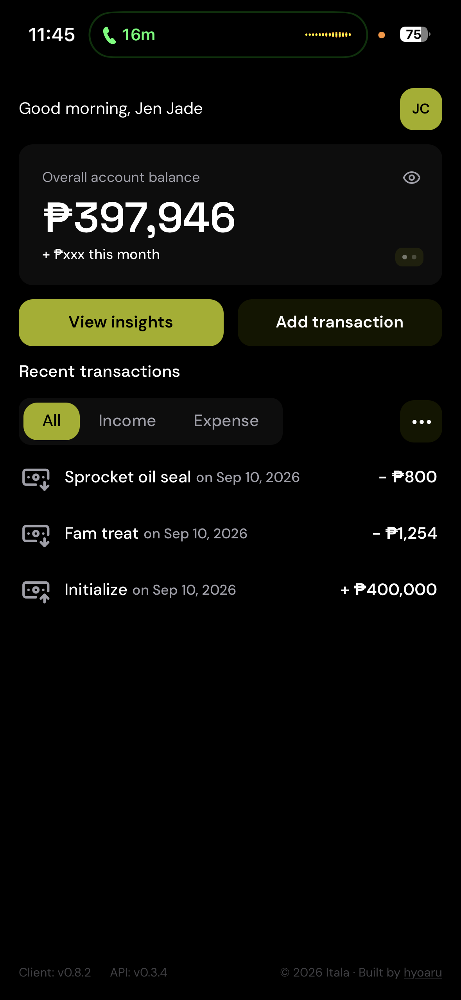
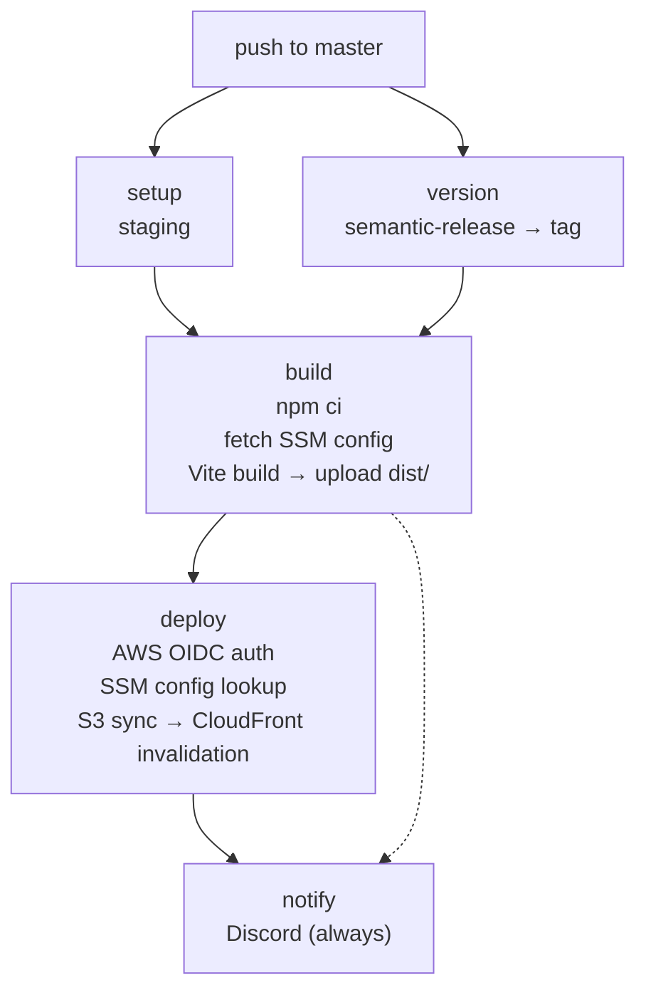
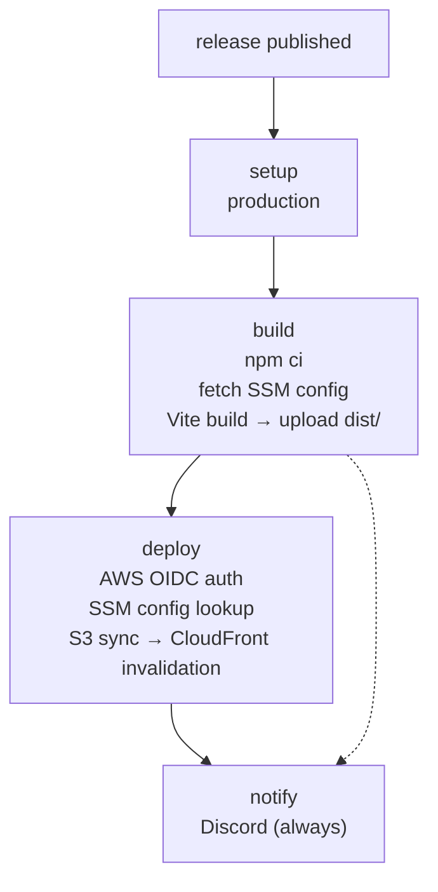

# Itala - Personal Finance PWA

Progressive Web App frontend for the [Itala](https://github.com/hyoaru/itala-pwa) personal finance platform. Built with React 19, TypeScript, and Vite. Manages accounts, categories, and transactions with a clean architecture approach. Part of the Itala ecosystem alongside the [API backend](https://github.com/hyoaru/itala-api), [workers](https://github.com/hyoaru/itala-workers), and [infrastructure](https://github.com/hyoaru/itala-infrastructure).

<table>
  <tr>
    <td width="33%"></td>
    <td width="33%"></td>
    <td width="33%"></td>
  </tr>
</table>

## Architecture

The codebase follows clean architecture (hexagonal) with domain, application, and infrastructure layers under `src/`. Domain entities and use cases are framework-free. Infrastructure adapters handle Cognito authentication, HTTP API communication, routing, state management, and UI rendering with HeroUI components.

Decorator patterns wrap adapters with logging and error handling. TanStack Query provides server state caching with infinite queries for cursor-based pagination. An Axios interceptor handles automatic token refresh on 401 responses.

Development follows trunk-based development with `master` as the single long-lived branch. All work is committed directly to `master` or merged via short-lived PRs. [Semantic-release](https://github.com/semantic-release/semantic-release) automates versioning based on conventional commits. Pushing to `master` deploys to staging; publishing a GitHub release promotes to production.

### Platform Architecture


## Project Structure

```
itala-pwa/
├── src/
│   ├── main.tsx                      # App entry point
│   ├── domain/
│   │   ├── entities/                 # User, Account, Category, Transaction, AuthenticatedSession
│   │   └── value-objects/            # TransactionType
│   ├── application/
│   │   ├── use-cases/                # One per operation (sign-in, create-account, etc.)
│   │   └── ports/
│   │       ├── identity-provider/    # Auth interface + error types
│   │       ├── account-repository/   # Account CRUD interface
│   │       ├── category-repository/  # Category CRUD interface
│   │       └── transaction-repository/ # Transaction CRUD interface
│   └── infrastructure/
│       ├── adapters/
│       │   ├── identity-provider/    # Cognito adapter + decorators
│       │   ├── account-repository/   # HTTP adapter + decorators
│       │   ├── category-repository/  # HTTP adapter + decorators
│       │   └── transaction-repository/ # HTTP adapter + decorators
│       ├── router/                   # TanStack Router config + routes
│       ├── contexts/                 # Authentication session provider
│       ├── stores/                   # Zustand (balance visibility)
│       ├── hooks/                    # Custom hooks (identity, account, category, etc.)
│       ├── components/               # UI components
│       ├── forms/                    # Form utilities
│       ├── validators/               # Zod schemas
│       ├── events/                   # Session event emitter
│       ├── logger/                   # Console logger adapter
│       ├── container.ts              # Axios client with auth interceptor
│       ├── app.tsx                   # Root app component
│       └── globals.css               # Tailwind + HeroUI + theme CSS
├── docs/assets/                    # Architecture diagrams
├── public/                           # PWA icons and static assets
├── .env.example                      # Required environment variables template
├── vite.config.ts                    # Vite + plugins config
├── tsconfig.json                     # TypeScript config
└── package.json
```

## Environment Variables

| Variable                       | Description                        |
| ------------------------------ | ---------------------------------- |
| `VITE_VERSION`                 | Client version displayed in footer |
| `VITE_AWS_REGION`              | AWS region for Cognito             |
| `VITE_AWS_USER_POOL_CLIENT_ID` | Cognito User Pool client ID        |
| `VITE_API_BASE_URL`            | Backend API base URL               |

## Tech Stack

- **React 19** — UI framework
- **TypeScript 6** — type-safe JavaScript
- **Vite 8** — build tool and dev server
- **TanStack Router** — file-based routing with code splitting
- **TanStack Query** — server state management
- **TanStack Form** — form handling with Zod validation
- **HeroUI** — component library
- **Tailwind CSS v4** — utility-first styling
- **Zustand** — client state (balance visibility)
- **Axios** — HTTP client with auth interceptor
- **next-themes** — dark mode / theme switching
- **vite-plugin-pwa** — service worker and PWA manifest
- **Cognito** — authentication via `@aws-sdk/client-cognito-identity-provider`

## Prerequisites

- Node.js 24+
- npm
- A running [itala-api](https://github.com/hyoaru/itala-api) instance (local or deployed)
- Amazon Cognito User Pool with a configured client

## Deployment

### CI/CD Pipeline

Deployments are fully automated via GitHub Actions. All pipelines use OIDC-based AWS authentication (no static credentials), fetch configuration from SSM Parameter Store, and notify Discord on completion.

#### Staging — `release.yml`

Triggered on push to `master`. Runs semantic-release to determine the next version, builds the Vite production bundle, and deploys to the staging CloudFront distribution.



#### Production — `publish.yml`

Triggered when a GitHub release is published. Builds from the release tag and deploys to the production CloudFront distribution.


